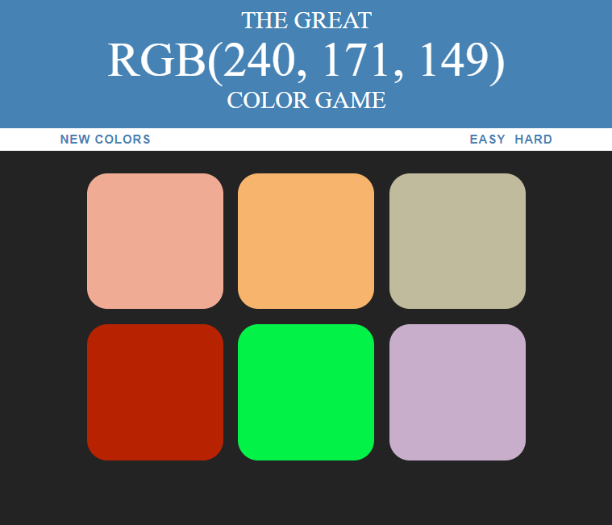

# COLOR PICKER GAME

### Guess the color game build with React and vanila JS.

<br>

## Demo

<p align="center">
  
</p>
<br><br>

## Getting Started

To get a local copy up and running follow these simple example steps.

### Installation

1. Clone the repo
   ```sh
   git clone https://github.com/genadi53/DSS-assignment.git
   ```
2. Install NPM packages
   ```sh
   cd react-colors
   npm install
   ```
3. Run the app

   ```sh
    npm start

   ```

   Open [http://localhost:3000](http://localhost:3000) to view it in the browser.

<!-- USAGE EXAMPLES -->
